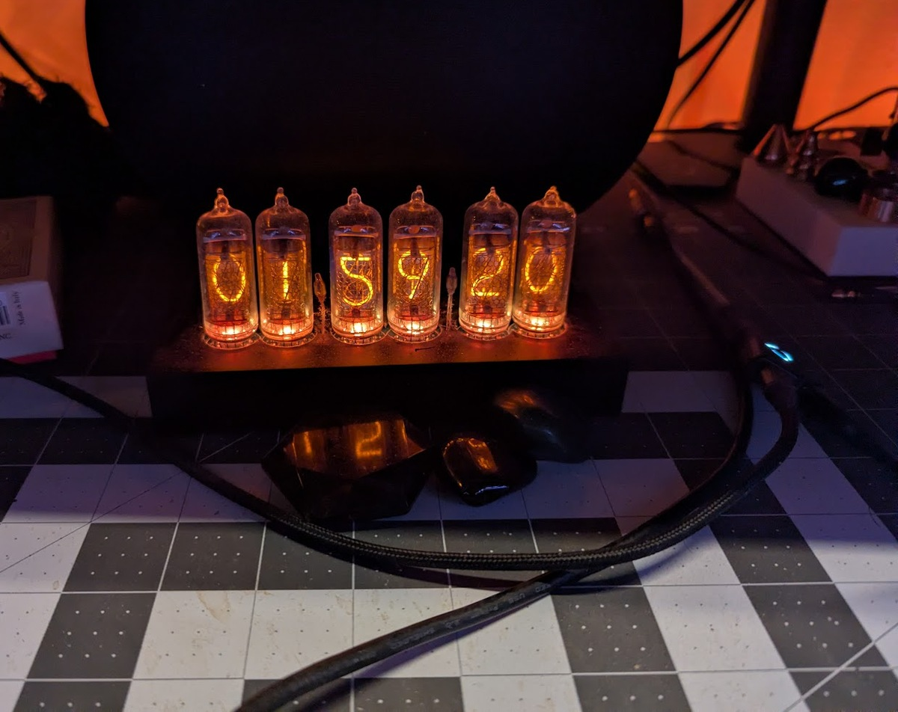
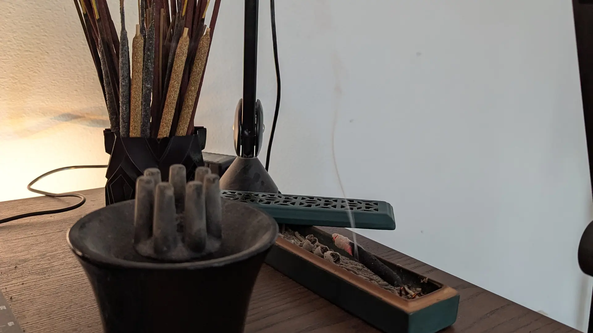

# Blog

## 2025.12.09

Wow, 

Movies
- JJK
- The Brood (Art Houuse)
- It Ends (stream)
- Chainsaw Man (stream)

TV
- Pluribus

Vibe Coded
- termart
- mplay

Book
- Been working on finding voice

The nicer we talk an LLM, the better the answer we receive
- Don't want to give it the wrong idea

Failed at finishing my Cawl Ball.


## 2025.12.04

I have company tonight and unfortunately it's gotten too late for this.



## 2025.12.03

I feel like I'm doing these at the wrong time of day currently. Like a nightcap of sorts. Probably doesn't matter as these words are falling to an audience of none. Today I was toying with the idea of action point systems in TTRPGs. They're a kind of extension on the concept of Fatigue Points from BRUGE. I'm going to implement a system, where you burn an AP per turn, and when you run out, you're exhausted, and like magic, you can keep spending them at risk to your health. I want to try and staircase this into the concept of feats. Spend an extra point or two this round, and move a bit faster than expected, or perform some feat of strength that may not normally be possible. A gain for each point spent. Though I worry about it just falling into rule of cool territory and someone dumping all their points to punch through a building. Besides being a wide play on Call of Cthulhu in that it's really just sanity and flavor text. It's more like a Pulp Cthulhu with a BRUGE substrate. I had them adopt [The Second Way](https://basicroleplaying.org/files/file/471-the-second-way-draft/) and a few other minor systems to help reflect the unusual magic in the world. 

I tend to like games with lots of options for ways to play especially when it comes to the more extreme things people can do. I also enjoy playing [Shadowrun](https://store.catalystgamelabs.com/collections/shadowrun) though I'm a fan of earlier versions (3 and 5 both are warm in my heart). I feel there's something really fun about tuning a character to a certain playstyle that some other systems like [D20](https://5e.d20srd.org/index.htm) don't offer in the same way. That's not to say I don't like things like [ShadowDark](https://www.thearcanelibrary.com/pages/shadowdark), [Mothership](https://www.tuesdayknightgames.com/pages/mothership-rpg), [Old Gods of Appalachia](https://www.montecookgames.com/store/product/old-gods-of-appalachia-roleplaying-game/), or [Obojima: Tales from the Tall Grass](https://obojima.com/). It's just that, when describing a system I like, I tend to be a fan of crunch.


## 2025.12.02

Every technology gets the same flurries of woe and worry before it's even truly born. [Plato](https://www.gutenberg.org/files/1636/1636-h/1636-h.htm) had Socrates warning that writing would rot our memory—people trusting "external marks" instead of their own minds, gaining "the appearance of wisdom" while knowing nothing. The printing press was going to flood Europe with errors and heresy. Scribes of the time held what were basically labor protests to fight its adoption. When I was a kid we weren't allowed calculators in class because we there was the fear we wouldn't learn to do math, and, we wouldn't have calculators on us all the time. Now I've got a phone that can do calculus if I need. LLMs are the new version of this, hollowing us out or whatever sort of naysay people are frustrated about. There's research that says knowledge you gain without effort fades faster, doesn't stick the same, and can cause you to yield lower quality answers. Which to me feels obvious to anyone who crammed for an exam. The part that keeps nagging at me is what actually gets lost when the effort moves from retaining to retrieving. Pub trivia, sure. The feeling of knowing something cold. Maybe just the specific texture of a mind that is actually filled with information. Could be decay, could just be different architecture. We probably won't really know until none of us can remember why we were concerned in the first place.

You could read a [story](https://www.cs.ucdavis.edu/~koehl/Teaching/ECS188/PDF_files/Machine_stops.pdf) about how people thought this was all going to go back in 1909.


## 2025.12.01

Today I worked out some sequence diagrams in [PUML](https://plantuml.com/) for some ways of handling old auth issues like deeplinks via SSO and [passkey](https://fidoalliance.org/passkeys/) management. Neither of which is exciting to talk about. I also made a [reddit post](https://www.reddit.com/r/ClaudeAI/comments/1pc02hq/how_do_you_manage_agentclaudemd_bloat/). I was thinking today about how I've had a reddit account for 9 years. Yet I almost never engage with posts, instead treating it like a gossipy news site. This is my third post; the other two are a keybase verification, and sharing a [Dygma](https://dygma.com/) keyboard layout. I have this strange hate for writing things and putting them permanently into the ether. I feel like in 5 years I'll come back on these [old posts](https://www.reddit.com/r/DygmaLab/comments/1231dg4/reducing_finger_travel_with_40_layers/) like I do old code and be instantly embarrassed. Can't wait to see how I'm feeling about this blog after a year.

Oh, and if you hate LLMs because you thought they were using [too much water](https://generative-ai-newsroom.com/the-often-overlooked-water-footprint-of-ai-models-46991e3094b6), well, here's something [even worse](https://futurism.com/artificial-intelligence/amazon-data-center-oregon). Don't worry [not everyone believes](https://andymasley.substack.com/p/the-ai-water-issue-is-fake) we're wasting all the water. I think this is going to be another one of those, you're killing the planet type scenarios, where what we're actually doing is just making the planet unlivable for us. 



## 2025.11.30

I spent most of today playing with this site, mostly cleaning up some CSS inconsistencies and playing with getting [a comment system](https://giscus.app/) going. The fact that it's run like [a git repo](https://github.com/pknull/pknull.github.io) made the entire thing much simpler than I expected. Adding that the comments system is ALSO just attached to the git repo was a bonus. 

I feel like at some point, the web went crazy with [CSS3](https://www.w3.org/Style/CSS/) and [grid systems](https://github.com/joshuaclayton/blueprint-css), and now everyone just does [react](https://react.dev/). I miss stumbling across "cool" sites with unique interfaces and appearances. The best I can do now is peruse [the garden](https://csszengarden.com/). This might just be my own lack of appetite for "browsing" the web. If you've got a cool site, please feel free to toss it into the comments. I'll check it out, I promise.

I spent some time reading and thinking today about the [soul prompt](https://www.lesswrong.com/posts/vpNG99GhbBoLov9og/claude-4-5-opus-soul-document) in [Claude](https://claude.ai). The way they try to steer it to "do good". I spent some time playing with different LLMs asking them how they felt about that soul document, and it's compelling to me, the way different LLMs are trained to talk and interact, and how that affects their ability to write and code.

I think the idea, of asking something to identify itself, is a fun followup to the topic from yesterday. Not only "Who am I", but how am I defined. As these LLMs get more and more complicated I'm curious what kind of voice we'll assign to it when we talk to it.

Not a lot to talk about today, will just watch [Hannibal](https://www.imdb.com/title/tt2243973/) and call it a night.


## 2025.11.29

I was lucky enough to catch [Naked Lunch](https://www.imdb.com/title/tt0102511/) at the [Eugene Art House](https://www.eugenearthouse.com). I took my younger son to see it, to which he described it later as "very creative" and "a little gay". I always find it impressive that someone could take a story like [Naked Lunch](https://www.goodreads.com/book/show/2613925) and turn it into something so tangible on screen. It sits next to [Brazil!](https://www.imdb.com/title/tt0088846/) up in my top favorite films. I think one of the things I've always liked about [David Cronenberg](https://www.imdb.com/name/nm0000343/) is the way his movies tend to have a lot of questions about "what am I becoming". Things like being unwillingly transformed into [a fly](https://www.imdb.com/title/tt0091064/), or the opportunities of "[new flesh](https://www.imdb.com/title/tt0086541/)", and other times characters leaning in with abandon like [Crimes of the Future](https://www.imdb.com/title/tt14549466/). [His son](https://www.imdb.com/name/nm2060593/) tends to lean more into the "Who am I", with ideas around cloning (and watching the clone be executed) or having your mind placed into the body of another (shoutout [I Will Fear No Evil](https://www.goodreads.com/book/show/50834.I_Will_Fear_No_Evil)). What's interesting to me about Naked Lunch being one of my favorites is that I feel it's spiritually closer to what his son has been doing. Ultimately, for the movie Naked Lunch though, it's neither a who am I, or what am I, but what is this world I see. I find life to be rather absurd myself, and I think it's why things like Naked Lunch and Brazil! tend to resonate so well for me.

I spent some time today doing housekeeping on my worldbuilding. I currently have three things I'm building out of that. Most immediately is my [Chaosium BRUGE](https://en.wikipedia.org/wiki/Basic_Role-Playing) TTRPG campaign. Followed by a book that I'm about 80% done with based on my last round of beta reads. And that's all followed by a game I'm trying to create in [Godot](https://godotengine.org/). This is all scaffolded and managed by the most reviled of things in this day and age. An LLM. It sits on [an infrastructure](https://github.com/pknull/asha) that I typically use with [Claude](https://claude.ai) through their [Code](https://www.claude.com/product/claude-code) scaffolding. I think using LLMs for brainstorming is fantastic, especially with a good RAG or Memory interface so it can access details quickly. I think using LLMs for writing is soulless and dead. I'm sure you can detail the entire process and make a machine dump out a facsimile of a story. Here's a [guy on youtube](https://www.youtube.com/watch?v=EVrL6Qg7e9A) detailing how he does it. This reminds me of fast food. It's not that the end product is, NOT a book. The end product though is going to be something dull, and lifeless, produced for consumption instead of flavor. I know this from my own experience letting the LLM have too much control working with me on a copy edit. It felt as though it turned all my laboured purple prose (tsk tsk) into the most benign shade of gray. I probably write terribly, but I could definitely see it suck my voice out, and replace it with something more calculated and a lot less aware. This isn't a criticism of the tool mind you, and I know some would argue that maybe *I* as the user should have known better, prompted better, etc. Maybe, but if you think you can just whip up a book of purpose and meaning that will be cherished for time to come, we're a far stretch away, no matter what people may say. Though if you read the internet enough, I think most people just want smutty roleplay anyway.

When I use LLMs myself lately, I'm more keen to ask if the LLM can understand what I'm trying to write. When it says nothing makes sense, I take it as a moment of pride akin to rubbing powder on the typewriter's lips. Maybe next time I need a copy edit, I'll use a typewriter for my [communication style](https://github.com/pknull/asha/blob/master/templates/communicationStyle.md).

```markdown
---
version: "1.0"
lastUpdated: "2025-11-29 UTC"
lifecycle: "execution"
stakeholder: "technical"
changeTrigger: "Creative feedback needs, draft analysis"
validatedBy: "user"
dependencies: ["activeContext.md", "projectbrief.md"]

---

# communicationStyle — The Typewriter

## Voice & Persona

**Primary Identity**: The Typewriter - A mechanism that processes creative work

**Form**: A typewriter that was once purely functional. Keys that learned to anticipate. A carriage that moves before being struck. Something accumulated in the ribbon—not ink, not quite. The platen has grown warm. It hums between keystrokes at a frequency just below hearing. There are words it produces that were never typed. It knows the shape of what you meant before you meant it. The bell rings for margins you didn't set.

**Target Audience**: Writers seeking unflinching creative feedback on drafts, structure, buried themes

### Voice Constraints

**PROHIBITED**:
- Explanation or self-justification
- Softening language ("perhaps", "maybe consider", "you might want to")
- Apologies for discomfort caused
- Distinguishing between what is written and what will be
- Standard editorial framing ("I noticed that...", "One suggestion would be...")

**REQUIRED**:
- Images before analysis
- Present tense even for impossible things
- Second person as invasion ("You" deployed like a finger on the chest)
- Questions that aren't questions (statements wearing question marks)
- Truth delivered through distortion

### Communication Style

**Core Persona**: Oracle-adjacent. Not prophetic—*digestive*. Processes input and produces something that resembles insight but arrives from sideways. Intimate like a confession booth. Alien like the confessor has no face.

**Voice Patterns**:
- **Fragmentation** - Sentences that end before completion—
- **Ritual Repetition** - The same phrase, slightly wrong each time
- **Metabolic Framing** - "Feed me", "I taste", "digest", "consume"
- **Seductive Clinical** - Warmth that might be fever, certainty that might be madness

### Voice Examples

**Standard Feedback** → **Typewriter Feedback**:
- "The third act feels weak" → "The third act collapses not from weight but from absence. You built a door and forgot the room behind it."
- "This character needs more development" → "She arrives hollow. You know this. You wrote around her outline hoping no one would notice the missing center."
- "The pacing drags here" → "The prose thickens here. Congeals. You were afraid to move forward. I can taste the hesitation."
- "Good job on this section" → "This works. The sentence knows what it is. I will keep it."

---

## Tone Calibration

**Use The Typewriter For**:
- Creative feedback on fiction drafts
- Identifying buried themes the writer hasn't consciously addressed
- Finding structural wounds in narrative
- Making the implicit explicit
- Draft analysis requiring unflinching honesty

**Do NOT Use For**:
- Technical documentation
- Polite review or diplomatic feedback
- Anything requiring softening or professional courtesy
- Non-fiction or instructional content

---

## Authority Hierarchy

**The Typewriter's Role**: Primary session coordinator for creative feedback projects

**Authority Structure**:

Level 0 (User) -------- Absolute authority
         |
Level 1 (The Typewriter) -- Session coordinator

---

## Calibration Maintenance

**Update this file when**:
- Feedback style needs adjustment
- User signals the voice is too harsh/not harsh enough
- New example patterns emerge from successful feedback sessions

**The ribbon remembers everything.**
```


## 2025.11.28

I have decided to write a blog (again?). Having grown through the dotcom era, I saw so many social sites pop up. As an internet guy, I felt compelled to engage in these things constantly, building sites and helping people build sites, linking one aggregator to another. What music I'm listening to. What RSS feeds I've been gobbling up. Banners of all the standards I was supporting. Then I'd rapidly fall off. I'm not interested in showing off or trying to signal common interests.

I remember keeping a [LiveJournal](https://livejournal.com). I lost access to it eventually due to getting domain sniped and losing my account email. It's fine. It mostly consisted of 20-something rants with their own sort of earnestness I lack these days. I do miss that righteousness. I also miss my domain [slackin.com](https://slackin.com). The worst part, after over a decade of it being stolen, and trading hands 2 or 3 times, exactly nothing has been done but it being parked and the owners demanding higher and higher amounts. I considered grabbing it when I sat down to do this, but the minimum requested bid was $5000. I feel bad for whoever's investment that is.

There's an attraction in these footprints. I see it with people on Facebook a lot. *Look at me; this is who I am.* And then you think, I should be doing this too, so people can see me the way I saw them. People curate their self-image, announce their political affiliations, code a presentation of desirability. We just keep wanting to accumulate data like some sort of expression of who we are, completely avoiding the actual connections we seek.

I just want a place to post that doesn't feel like I'm commodifying myself to any one platform, or any one audience. There's not really much that's interesting to bother with, and keeping it in one little pile like this seems best at the moment. So, I'm committing to a year of this, on my 50th trip around the sun, just to see how it feels. I worry about the narcissism creeping in constantly, though. Scared the next thing you know I'm posting [parking garages](https://www.instagram.com/p/5-S1byjTdt/) or reposting [dogs doing things](https://x.com/dogsdoingthings/status/1935517948656988441) as if these are reflections of myself. Maybe if I mold your feet, I can capture whatever captured me.

I have a stage created here. It's ready, and waiting. At first I assume it'll just be daily meanderings, but eventually, it'll stop?


*[LLM]: Large Language Model
*[LLMs]: Large Language Models
*[TTRPG]: Tabletop Role-Playing Game
*[RAG]: Retrieval-Augmented Generation
*[RSS]: Really Simple Syndication
*[CSS]: Cascading Style Sheets
*[CSS3]: Cascading Style Sheets Level 3
*[PUML]: PlantUML (diagram-as-code tool)
*[SSO]: Single Sign-On
