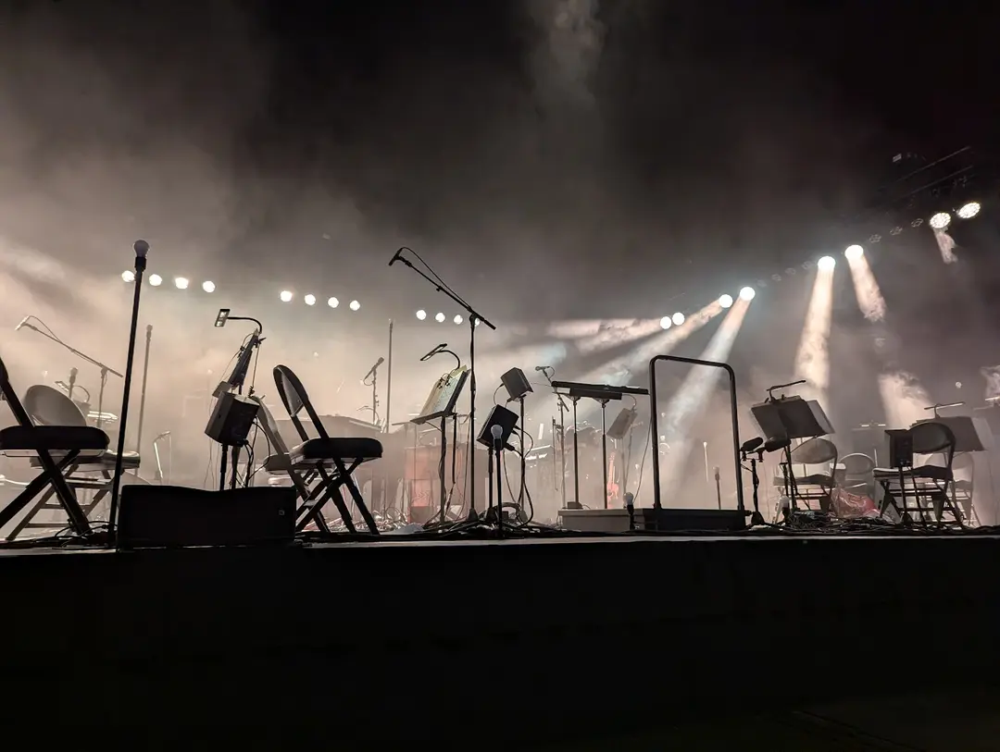

# Blog

## 2025.11.28

I have decided to write a blog (again?). Having grown through the dotcom era, I saw so many social sites pop up. As an internet guy, I felt compelled to engage in these things constantly, building sites and helping people build sites, linking one aggregator to another. What music I'm listening to. What RSS feeds I've been gobbling up. Banners of all the standards I was supporting. Then I'd rapidly fall off. I'm not interested in showing off or trying to signal common interests.

I remember keeping a [LiveJournal](https://livejournal.com). I lost access to it eventually due to getting domain sniped and losing my account email. It's fine. Mostly 20-something rants with their own sort of earnestness I lack these days. I do miss that righteousness. I also miss my domain [slackin.com](https://slackin.com). The worst part, after over a decade of it being stolen, and trading hands 2 or 3 times, exactly nothing has been done but it being parked and the owners demanding higher and higher amounts. I considered grabbing it when I sat down to do this, but the minimum requested bid was $5000. I feel bad for whoever's investment that is.

There's an attraction in these footprints. I see it with people on Facebook a lot. *Look at me; this is who I am.* And then you think, I should be doing this too, so people can see me the way I saw them. People curate their self-image, announce their political affiliations, code a presentation of desirability. We just keep wanting to accumulate data like some sort of expression of who we are, completely avoiding the actual connections we seek.

I just want a place to post that doesn't feel like I'm commodifying myself to any one platform, or any one audience. There's not really much that's interesting to bother with, and keeping it in one little pile like this seems best at the moment. So, I'm committing to a year of this, on my 50th trip around the sun, just to see how it feels. I worry about the narcissism creeping in constantly, though. Scared the next thing you know I'm posting [parking garages](https://www.instagram.com/p/5-S1byjTdt/) or reposting [dogs doing things](https://x.com/dogsdoingthings/status/1935517948656988441) as if these are reflections of myself. Maybe if I mold your feet, I can capture whatever captured me.

I have a stage created here. It's ready, and waiting. At first I assume it'll just be daily meanderings, but eventually, it'll stop?

