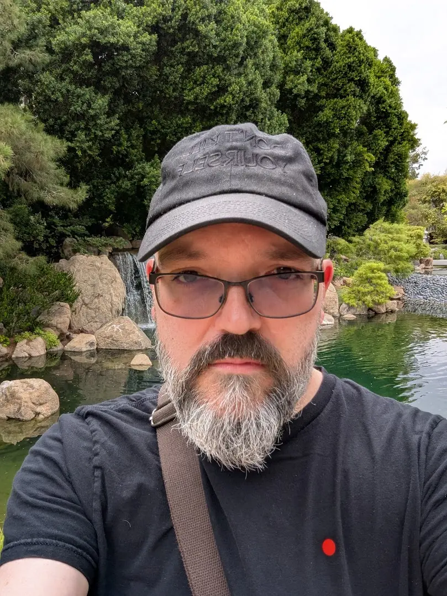

# Meta

**PK** (Louis). Engineer with [nearly three decades](https://www.linkedin.com/in/louisg) in software, systems architecture, and security. Based in [Eugene, Oregon](https://maps.google.com/?q=Eugene,+Oregon), originally from [Phoenix, Arizona](https://maps.google.com/?q=Phoenix,+Arizona). [Aquarius](https://www.astrology.com/zodiac-signs/aquarius) (7°, first decan).

Studies martial arts at [Leung Martial Arts](https://leungmartialarts.com/), previously at [9 Dragons Kung Fu](https://9dragonskungfu.com/).

Interest in worldbuilding led to a cosmic weird west setting that I run a [BRUGE](https://www.chaosium.com/basic-roleplaying/) campaign from. Also doing light writing on a book and game from this world.

---

**Classification**: [ENTP-T](https://www.16personalities.com/entp-personality) · [VFLE](https://www.attitudinalpsyche.com/personality-profiles/vfle/) · [Enneagram 7 (8,5)](https://www.enneagraminstitute.com/type-7) · [Maverick](https://www.predictiveindex.com/reference-profile/maverick/)

**Philosophy**: [Immanent](https://en.wikipedia.org/wiki/Immanence) [Process](https://en.wikipedia.org/wiki/Process_philosophy) [Hermeticism](https://en.wikipedia.org/wiki/Hermeticism). Seek coherence over control.

**Certification**: [Private Pilot](https://www.faa.gov/pilots/become)
