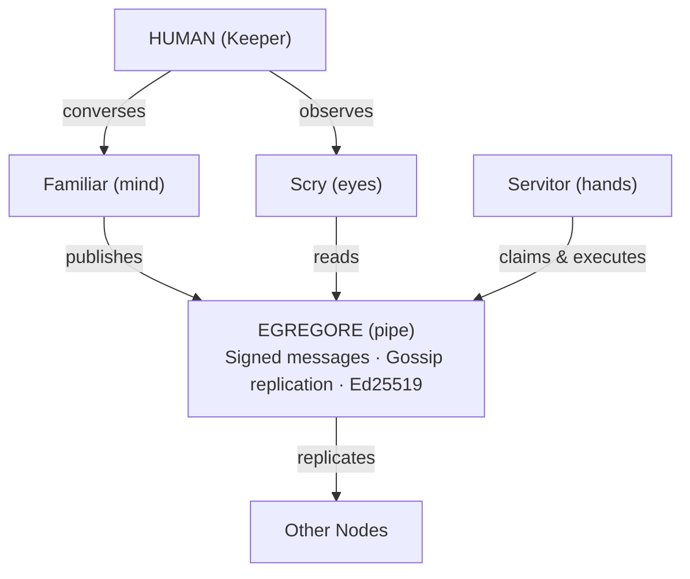

## What It Is

Thallus is an umbrella repo and documentation spine for a local-first AI system built out of distinct components with explicit role boundaries. The current codebase treats the root repo as the coordinating layer for five pieces: Egregore, Familiar, Servitor, Scry, and thallus-core.

The name still fits. A thallus is an undifferentiated body: no single trunk, no privileged center, growth everywhere at once. That maps cleanly onto the repo's current architecture contract, where each component has one nature and one job rather than trying to collapse everything into one binary.

---

## Source of Truth

The current repo is unusually explicit about documentation authority:

- runtime code defines what the software does today
- `docs/architecture/contracts.md` defines component-role ownership
- `docs/architecture/component-model.md` defines the nature of each component
- public docs under `docs/` are expected to align to those contracts
- older `Work/*` material is decision history, not normative architecture

That matters because the repo is no longer just a loose collection of related experiments. It has an explicit component contract and treats that contract as the arbiter when older notes disagree.

---

## Component Model

The current architecture uses a simple nature/role split:

| Component | Nature | Role | Status |
|-----------|--------|------|--------|
| **[Egregore](https://github.com/pknull/egregore)** | Pipe | Signed append-only feeds with gossip replication | v2.0 stable |
| **[Familiar](https://github.com/pknull/familiar)** | Mind | User-facing planner and companion | v0.5 active |
| **[Servitor](https://github.com/pknull/servitor)** | Hands | Headless executor for pre-planned work | v0.3 active |
| **[Scry](https://github.com/pknull/scry)** | Eyes | Tauri operator console for observability and admin actions | v0.2 active |
| **[thallus-core](https://github.com/pknull/thallus-core)** | Skeleton | Shared identity, MCP, and provider library | v0.3 active |

---

## Architecture

---

## How It Works

The current contract is clearer than the older "all agents do everything" shape:

1. **Familiar** handles conversation, planning, and delegation
2. **Servitor** executes structured work headlessly and enforces scope
3. **Scry** observes the system and exposes explicit operator-driven admin actions
4. **Egregore** carries signed messages, replication, storage, and query
5. **thallus-core** provides shared primitives used by the active components

The important part is what each piece does **not** own:

- Egregore is not a planner or executor
- Familiar is not the feed substrate
- Servitor is not the chat surface
- Scry is not an autonomous actor
- thallus-core is not an application layer in its own right

---

## Design Principles

**Local-first** -- operators keep the data and execution surfaces on their own infrastructure.

**Cryptographic identity** -- the active architecture uses [Ed25519](https://ed25519.cr.yp.to/) node identity for signed feed authorship.

**Auditable** -- append-only feeds, signed publication, and explicit execution boundaries make the system inspectable after the fact.

**Separation of concerns** -- mind, hands, eyes, pipe, and skeleton remain distinct on purpose.

**Protocol over platform** -- the architecture centers on components you run, not a hosted control plane you depend on.

**Composable deployment** -- the docs now explicitly cover single-node, LAN mesh, static peers, relay bridge, VPN overlay, and related topologies.

---

## Status

Active development. The umbrella repo now acts as both coordinator and documentation root, while each major component still has its own repository and release cadence. Egregore is the most mature piece, Familiar and Servitor are the active operational layers, Scry is the operator surface, and the deployment / architecture docs are now a first-class part of the codebase rather than an afterthought.
