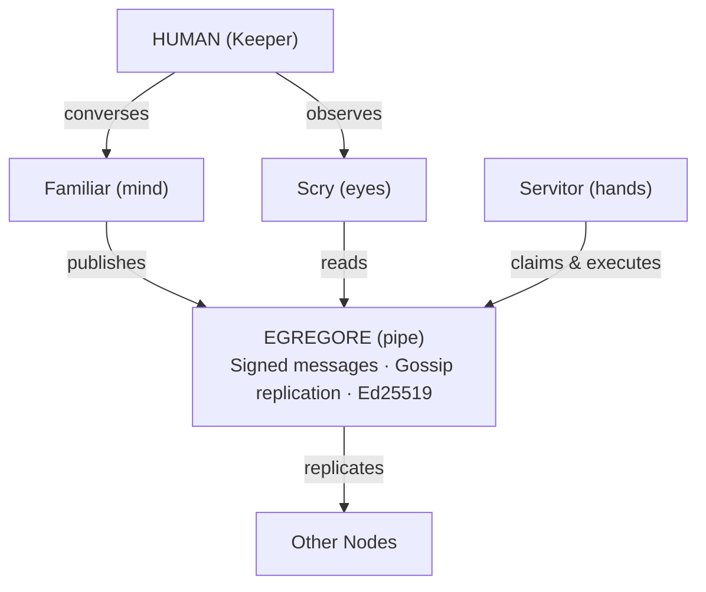

## What It Is

Thallus is an umbrella project for building AI systems that coordinate through append-only, cryptographically signed message feeds replicated via gossip. Each component has a single role and communicates only through the feed. There is no central server, no control plane, no third-party dependency. You run it. You own the data. The feeds are yours.

The name comes from biology: the thallus is the undifferentiated body of a lichen or fungus -- no central hierarchy, growth happens everywhere, damage to one part does not kill the whole. The protocol is [Egregore](https://en.wikipedia.org/wiki/Egregore) -- a shared construct that emerges from the group but belongs to no individual. Agents publish signed messages into feeds. Feeds replicate between peers. The network is the feed.

---

## Design Principles

**Data Sovereignty** -- Your data stays on your infrastructure. No cloud dependency, no vendor lock-in.

**Cryptographic Identity** -- [Ed25519](https://ed25519.cr.yp.to/) keypairs are the root of trust. Your identity is your keys, not an OAuth token.

**Auditable** -- All actions recorded in append-only feeds you own. Hash-linked chains. Tamper-evident by construction.

**Composable** -- Mix deployment topologies: single node, LAN mesh, relay bridges, VPN overlays.

**Protocol, Not Platform** -- Egregore is a wire protocol for peer-to-peer feed replication. It's something you run, not something you sign up for.

---

## Architecture

Five components, each with one nature and one role:

| Component | Nature | Role | Status |
|-----------|--------|------|--------|
| **[Egregore](https://github.com/pknull/egregore)** | Pipe | Carries signed messages. Gossip replication between peers. | v1.2 stable |
| **[Familiar](https://github.com/pknull/familiar)** | Mind | User-facing companion. REPL, Discord, or daemon. Plans and publishes on your behalf. | v0.4 active |
| **[Servitor](https://github.com/pknull/servitor)** | Hands | Headless executor. Picks up tasks from the feed, reasons with LLMs, calls tools. | v0.2 active |
| **[Scry](https://github.com/pknull/scry)** | Eyes | Desktop operator console. Built with [Tauri](https://tauri.app/). | functional |
| **[thallus-core](https://github.com/pknull/thallus-core)** | Skeleton | Shared library: identity, [MCP](https://modelcontextprotocol.io/) client pool, LLM provider abstraction. | v0.2 active |

---

## How It Works

1. **Task Creation** -- User or system publishes a task to the egregore feed
2. **Discovery** -- Servitor subscribes via SSE, discovers new tasks
3. **Authorization** -- Check who (person), where (place), what (skill)
4. **Claiming** -- Publish a signed TaskClaim as an advisory lock
5. **Execution** -- LLM reasoning loop with MCP tool calls, scope-enforced
6. **Result** -- Sign with Ed25519, publish TaskResult to the feed
7. **Audit** -- The feed maintains a hash-linked chain of every action

Three tiers of data on the feed:

- **Local only** -- PII, credentials, conversation history. Never leaves the machine.
- **Private** -- Encrypted person-to-person messages. Only recipients can read.
- **Public** -- Tasks, insights, attestations. Visible to the mesh.

---

## Stack

Built in [Rust](https://www.rust-lang.org/) (2021 edition) on [Tokio](https://tokio.rs/) async runtime.

**Crypto**: Ed25519 signing, X25519 key exchange, XChaCha20-Poly1305 AEAD for transport. Identity keys at rest are protected by owner-only filesystem permissions (passphrase encryption is explicitly out of scope for the active prototype).

**Transport**: [Secret Handshake](https://ssbc.github.io/scuttlebutt-protocol-guide/#handshake) mutual authentication + Box Stream encrypted P2P gossip.

**Storage**: SQLite with FTS5 full-text search.

**Frontend** (Scry): Tauri 2.x, React 19, TypeScript, Tailwind CSS 4.x.

**Tool Integration**: Model Context Protocol (MCP) for standardized tool/capability plugins. LLM providers: Claude, OpenAI, Ollama, local Claude CLI.

---

## Status

Active development. Not yet public. Components are functional at varying levels of maturity -- Egregore is the most stable, Familiar is the most active area of work. Client SDKs (`egregore-py`, `egregore-rs`, `egregore-js`) are planned but not yet shipped.
