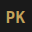

# Asha

This is a sample page demonstrating all markdown elements.

## Headings

### Third Level
#### Fourth Level
##### Fifth Level
###### Sixth Level

## Text Formatting

This is a regular paragraph with **bold text**, *italic text*, and ***bold italic***. You can also use `inline code` within paragraphs.

Here's a [link to somewhere](https://example.com) and here's some ~~strikethrough~~ text.

## Blockquotes

> This is a blockquote. It can contain multiple lines and represents quoted text or callouts.
>
> It can have multiple paragraphs too.

## Lists

### Unordered List

- First item
- Second item
  - Nested item
  - Another nested item
- Third item

### Ordered List

1. First step
2. Second step
   1. Sub-step one
   2. Sub-step two
3. Third step

## Code

Inline: `const x = 42;`

### JavaScript

```javascript
class EventEmitter {
  constructor() {
    this.events = new Map();
  }

  on(event, callback) {
    if (!this.events.has(event)) {
      this.events.set(event, []);
    }
    this.events.get(event).push(callback);
    return () => this.off(event, callback);
  }

  off(event, callback) {
    const callbacks = this.events.get(event);
    if (callbacks) {
      const index = callbacks.indexOf(callback);
      if (index > -1) callbacks.splice(index, 1);
    }
  }

  emit(event, ...args) {
    const callbacks = this.events.get(event) || [];
    callbacks.forEach(cb => cb.apply(this, args));
  }
}

// Usage
const emitter = new EventEmitter();
const unsubscribe = emitter.on('data', (payload) => {
  console.log('Received:', payload);
});
emitter.emit('data', { id: 1, name: 'test' });
```

### Python

```python
from dataclasses import dataclass
from typing import Optional, List
import asyncio

@dataclass
class Task:
    id: int
    title: str
    completed: bool = False
    tags: List[str] = None

    def __post_init__(self):
        self.tags = self.tags or []

class TaskManager:
    def __init__(self):
        self._tasks: dict[int, Task] = {}
        self._next_id = 1

    async def create(self, title: str, tags: Optional[List[str]] = None) -> Task:
        task = Task(id=self._next_id, title=title, tags=tags)
        self._tasks[task.id] = task
        self._next_id += 1
        await self._notify_observers('created', task)
        return task

    async def complete(self, task_id: int) -> Optional[Task]:
        if task := self._tasks.get(task_id):
            task.completed = True
            await self._notify_observers('completed', task)
            return task
        return None

    async def _notify_observers(self, event: str, task: Task):
        # Simulate async notification
        await asyncio.sleep(0.01)
        print(f"[{event}] Task #{task.id}: {task.title}")
```

### Bash

```bash
#!/usr/bin/env bash
set -euo pipefail

readonly SCRIPT_DIR="$(cd "$(dirname "${BASH_SOURCE[0]}")" && pwd)"
readonly LOG_FILE="${SCRIPT_DIR}/deploy.log"

log() {
    local level="$1"
    shift
    echo "[$(date '+%Y-%m-%d %H:%M:%S')] [${level}] $*" | tee -a "$LOG_FILE"
}

deploy() {
    local environment="${1:-staging}"
    local version="${2:-latest}"

    log "INFO" "Starting deployment to ${environment}"
    log "INFO" "Version: ${version}"

    if [[ "$environment" == "production" ]]; then
        log "WARN" "Production deployment - requiring confirmation"
        read -p "Continue? [y/N] " -n 1 -r
        echo
        [[ $REPLY =~ ^[Yy]$ ]] || { log "INFO" "Aborted"; exit 0; }
    fi

    log "INFO" "Pulling container image..."
    docker pull "myapp:${version}"

    log "INFO" "Stopping existing container..."
    docker stop myapp-"${environment}" 2>/dev/null || true

    log "INFO" "Starting new container..."
    docker run -d --name "myapp-${environment}" \
        -e "ENVIRONMENT=${environment}" \
        "myapp:${version}"

    log "INFO" "Deployment complete"
}

deploy "$@"
```

### CSS

```css
:root {
  --color-primary: oklch(65% 0.15 250);
  --color-surface: oklch(20% 0.02 250);
  --space-unit: clamp(0.5rem, 2vw, 1rem);
  --transition-smooth: 200ms cubic-bezier(0.4, 0, 0.2, 1);
}

@layer components {
  .card {
    container-type: inline-size;
    background: var(--color-surface);
    border-radius: calc(var(--space-unit) * 2);
    padding: var(--space-unit);
    transition: transform var(--transition-smooth),
                box-shadow var(--transition-smooth);

    &:hover {
      transform: translateY(-2px);
      box-shadow: 0 8px 24px oklch(0% 0 0 / 0.2);
    }

    @container (min-width: 400px) {
      display: grid;
      grid-template-columns: auto 1fr;
      gap: var(--space-unit);
    }
  }
}
```

### SQL

```sql
WITH monthly_revenue AS (
    SELECT
        DATE_TRUNC('month', order_date) AS month,
        customer_id,
        SUM(total_amount) AS revenue
    FROM orders
    WHERE order_date >= CURRENT_DATE - INTERVAL '12 months'
      AND status = 'completed'
    GROUP BY 1, 2
),
customer_segments AS (
    SELECT
        customer_id,
        AVG(revenue) AS avg_monthly_revenue,
        COUNT(DISTINCT month) AS active_months,
        CASE
            WHEN AVG(revenue) >= 1000 THEN 'enterprise'
            WHEN AVG(revenue) >= 100 THEN 'business'
            ELSE 'starter'
        END AS segment
    FROM monthly_revenue
    GROUP BY customer_id
)
SELECT
    segment,
    COUNT(*) AS customer_count,
    ROUND(AVG(avg_monthly_revenue), 2) AS avg_revenue,
    SUM(avg_monthly_revenue * active_months) AS total_ltv
FROM customer_segments
GROUP BY segment
ORDER BY total_ltv DESC;
```

## Tables

| Name | Role | Status |
|------|------|--------|
| Asha | Assistant | Active |
| PK | Creator | Active |
| Silas | Character | Fictional |

## Horizontal Rule

Content above.

---

Content below.

## Images



## Nested Elements

> **Note:** This blockquote contains:
> - A list item
> - Another with `code`
> - And a [link](https://example.com)

## Long Paragraph

Lorem ipsum dolor sit amet, consectetur adipiscing elit. Sed do eiusmod tempor incididunt ut labore et dolore magna aliqua. Ut enim ad minim veniam, quis nostrud exercitation ullamco laboris nisi ut aliquip ex ea commodo consequat. Duis aute irure dolor in reprehenderit in voluptate velit esse cillum dolore eu fugiat nulla pariatur.

## HTML Elements (Extended Testing)

### Subscript and Superscript

H<sub>2</sub>O is water. E = mc<sup>2</sup> is famous.

The formula: <var>f</var>(<var>x</var>) = <var>a</var><sub>0</sub> + <var>a</var><sub>1</sub><var>x</var> + <var>a</var><sub>2</sub><var>x</var><sup>2</sup>

### Small Text and Strikethrough

<small>This is small text for fine print or copyright.</small>

<s>This content is no longer accurate.</s>

### Abbreviations

<abbr title="HyperText Markup Language">HTML</abbr> is the standard markup language.

### Keyboard Input

To save, press <kbd>Ctrl</kbd> + <kbd>S</kbd> (or <kbd>Cmd</kbd> + <kbd>S</kbd> on Mac).

### Sample Output

<samp>
$ ls -la
total 64
drwxr-xr-x  12 user  staff   384 Nov 28 05:00 .
drwxr-xr-x   5 user  staff   160 Nov 28 04:00 ..
-rw-r--r--   1 user  staff  2048 Nov 28 05:00 index.html
</samp>

### Figure with Caption

<figure>
  
  <figcaption>The site favicon - a minimal glyph.</figcaption>
</figure>

### Definition List

<dl>
  <dt>Coherence</dt>
  <dd>The quality of forming a unified whole; internal consistency.</dd>
  <dt>Resonance</dt>
  <dd>The reinforcement of vibrations by synchronous influence.</dd>
  <dt>Process</dt>
  <dd>A series of actions or steps toward a particular end.</dd>
</dl>

### Details/Summary (Collapsible)

<details>
  <summary>Click to expand</summary>

  This content is hidden by default and revealed on click. Useful for FAQs or optional information.
</details>

### Mark (Highlight)

This sentence has <mark>highlighted text</mark> within it.

### Time

Published on <time datetime="2025-11-28">November 28, 2025</time>.

## Comments

<script>
  // Detect current theme for Giscus
  function getGiscusTheme() {
    var theme = localStorage.getItem('theme') || 'light';
    return window.location.origin + '/css/giscus-' + theme + '.css';
  }
</script>

<script src="https://giscus.app/client.js"
        data-repo="pknull/pknull.github.io"
        data-repo-id="R_kgDOQewMNA"
        data-category="Blog Comments"
        data-category-id="DIC_kwDOQewMNM4CzNFI"
        data-mapping="specific"
        data-term="test"
        data-strict="0"
        data-reactions-enabled="1"
        data-emit-metadata="0"
        data-input-position="top"
        data-theme="https://pknull.ai/css/giscus-light.css"
        data-lang="en"
        data-loading="lazy"
        crossorigin="anonymous"
        async>
</script>
